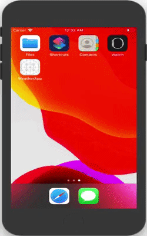

# WeatherApi + Moya + MVVM
Weather app display the weather information as per your current location i.e coorinates

# Purpose
_Weatherapp_is the repo to understand and learn MVVM design pattern with the help of Moya framework. Moya framework is used for the API calls.

# Authors
- Tushar Jaunjalkar

# What you will learn?:
- MVVM design pattern
- Moya integration 
- Data binding
- Swift 5.0
- Storyboards

# Moya
Moya is a networking library focused on encapsulating network requests in a type-safe way, typically by using enumerations (e.g., enum) to provide compile-time guarantees and confidence when working with your network layer, along with added discoverability.

It is Network Abstraction Library. It provides us with an abstraction to make network calls without directly communicating with Alamofire. 
 CocoaPods - pod 'Moya'
 
# Flow

## Demo

